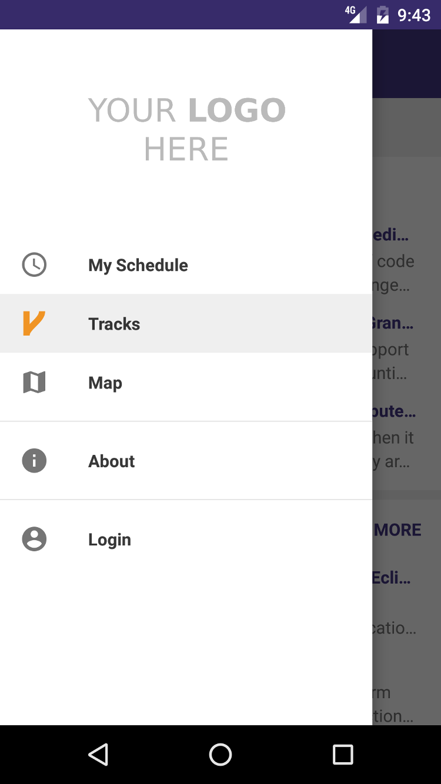
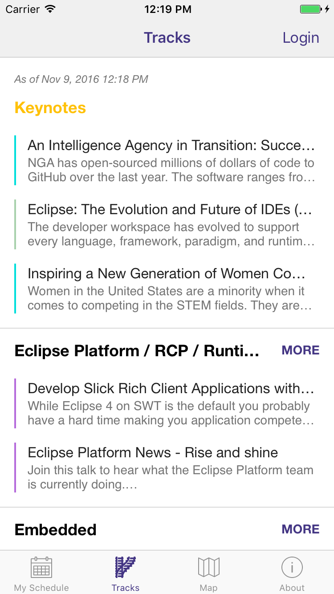

# Tabris Con
[](https://travis-ci.org/eclipsesource/tabris-con)

A template for conference apps built with [Tabris.js](http://tabrisjs.com).

| Android | iOS |
|---|---|
|||

## Running the app
Fork the repository and build the app on [tabrisjs.com](http://tabrisjs.com) in _Debug_ mode. Install the app on your device.

Before you serve the app for the first time, you need to install `yarn` globally:

```js
npm install -g yarn
```

Then run:

```js
yarn
yarn start
```
... and point your device to the URL printed in the console.

## Customizing the app for your conference
Tabris Con is an app template, which you can use as a starting point for developing your conference app. Most important parameters are exposed in a tweakable configuration file. For a reference, see `src/configs/googleIO2015Config.js` and `src/configs/eclipseCon2016Config.js`.

To use your own configuration, change the import in `src/configs/config.js`:

```js
import conferenceConfiguration from "./myConferenceConfig";
```
